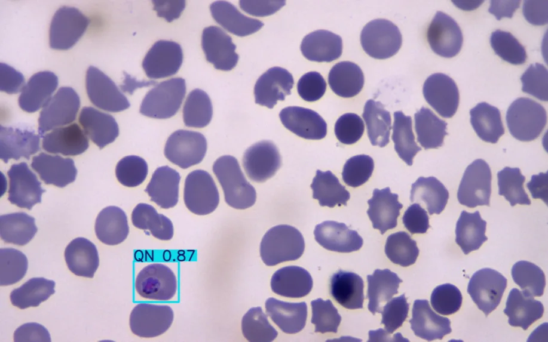

**Plasmosight is** a web application developed to assist doctors and medical professionals in treating malaria and managing patient care, especially in cases where patients are unable to communicate whether they have received treatment. This project is designed to bridge the gap between laboratory diagnosis and clinical practice by utilizing advanced neural network technology to analyze blood cell images and identify morphological changes in malaria parasites.

**Plasmosight** is designed to be user-friendly and to reduce the workload of healthcare professionals by providing information about the patient's treatment status—whether they have received specific antimalarial drugs or the stage of malaria parasites present—through blood sample image analysis. With its intuitive interface and advanced image analysis capabilities, **Plasmosight** enhances diagnostic efficiency.

