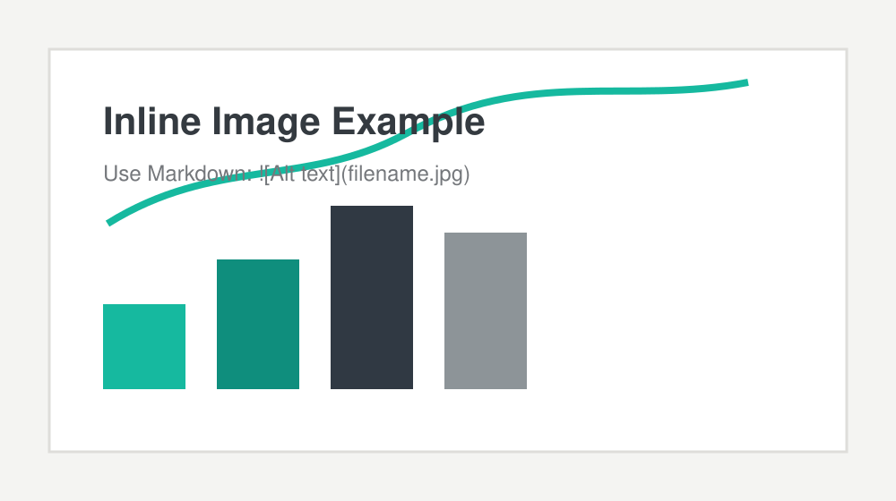

This starter post introduces the new Hugo website structure. The site is organized around news and activities, models and projects, publications, job opportunities, and collaboration pages.

The first implementation focuses on a clean academic layout, searchable content, an archive, and simple section pages that can be expanded as the research programme grows.

## Example Inline Image

Put any image file in this same folder and reference it by filename:

```text
content/news/2026/launching-the-new-website/
  index.md
  cover.jpg
  workshop-photo.jpg
```

Then use normal Markdown:

```markdown

```

This placeholder image is included only as an example:


