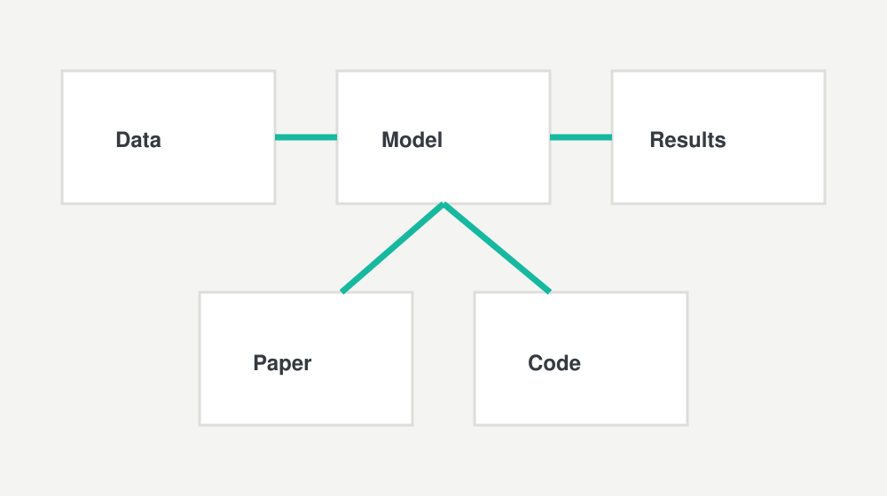

Replace this placeholder with a real paper, preprint, technical report, or policy brief.

A publication page can include citation details, DOI, abstract, project links, code availability, data availability, funder information, and related news posts.

## Example Publication Figure

For a publication page, keep paper-specific images and PDFs in the same folder:

```text
content/publications/2026/example-publication-record/
  index.md
  cover.jpg
  graphical-abstract.jpg
  paper.pdf
```

Then reference them in the page:

```markdown


[Download the paper](paper.pdf)
```

Placeholder figure:


